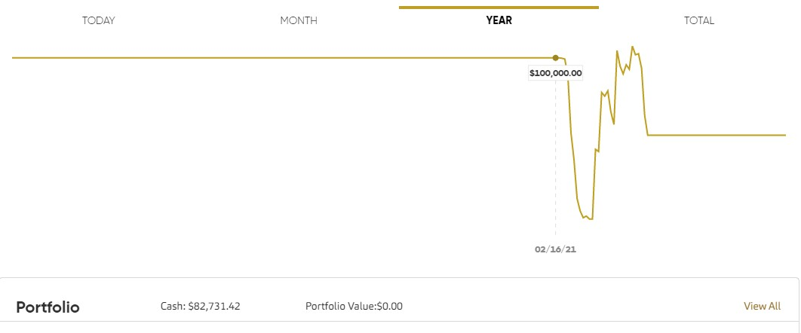
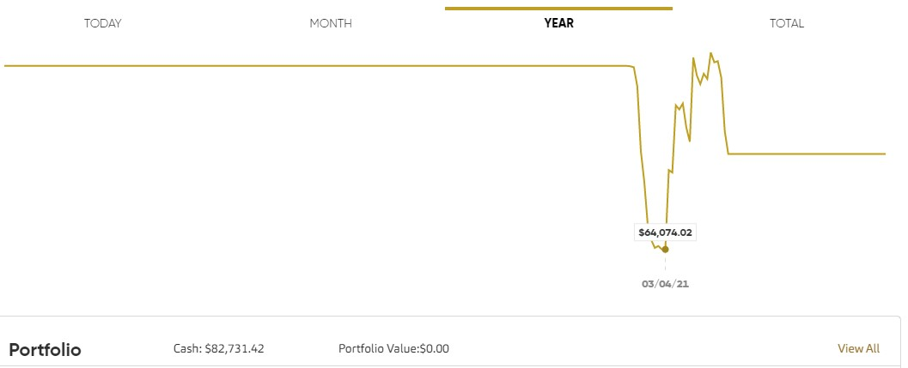
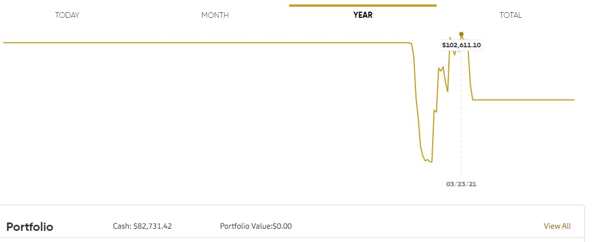

# Algo Trader 

## General workflow 

scraper scrapes gaps into csv -> assessor evaluates based on criteria ->
trader makes trades from the stocks passing criteria -> watcher exits trades systematically

## First

setup virtual environment (note: this is for cmd on Windows)

`python3 -m venv trading-env && trading-env\Scripts\activate.bat`

if changing to a different environment:

`deactivate && path-to-new-env\Scripts\activate.bat`

run 

`pip install -r requirements.txt`

## Second

create a `.env` file and add your api key and secret key:

```
CHROMEDRIVER_DIR=<path to chromedriver>
CHROME_DIR=<path to chrome>
CALLBACK_URL=<exactly what is on your app that you created>
CONSUMER_KEY=<your consumer key>
ACCOUNT_ID=<your numerical account number>
```

## Third
[Download the most recent chrome webdrivers here.](https://chromedriver.chromium.org/downloads)

Then, run `python setup_folders.py`.

Then place 1 chromedriver in each newly created folder.

So the results should look like:

```
root-|
     |-chromedrivers-|
                     |-1-|
                         |-chromedriver.exe
                     |
                     |-2-|
                         |-chromedriver.exe <-- different version
                     |
                     |-3-|
                         |-chromedriver.exe <-- different version
```

## Fourth

In the command line, make sure you're in the root directory and type:
`python control.py`

or 

`python3 control.py`

## Does it work?

This is day 1 trading on a paper account:


Started with a fresh account going in to development.


What the account looked like after development (~$60k USD, which would be a decent starting point for a lot of people)


Made the money back, plus some! All in 3 weeks.

## ***Note: This is not financial advice. Speak to someone that knows about money before trying this with your own real money.***